# Lab Sign-Off Application - Database Schema Design

## Database Collections Overview

### How to view diagrams
1.Download Markdown Preview Mermaid Support
    ID: bierner.markdown-mermaid
    Publisher: Matt Bierner
    Install: Search "Markdown Preview Mermaid Support" in VS Code Extensions

2.Then Press Cmd+Shift+V (Mac) or Ctrl+Shift+V (Windows) to open Markdown Preview

3.The Mermaid diagrams will render automatically

### Core Collections:

**USER** - Stores user accounts from Auth0
- id (PK), auth0Id (UK), email (UK)
- name, firstName, lastName, picture
- roles[], primaryRole, roleHistory[]
- createdAt, lastLogin

**CLASS** - Course/class management
- id (PK), courseCode, courseName, section, term
- instructorId (FK → USER), roster[], taIds[]
- canvasMetadata{}, archived
- createdAt, updatedAt

**ENROLLMENT** - User-to-Class relationships
- id (PK), userId (FK → USER), classId (FK → CLASS)
- role (Student/TA/Teacher), status (active/dropped/completed)
- enrolledAt, updatedAt, upgradeRequestedBy

**LAB** - Lab assignments within a class
- id (PK), classId (FK → CLASS), title, description
- points (= checkpoints), joinCode (UK), status
- startTime, endTime, maxGroupSize, minGroupSize
- autoRandomize, checkpoints[], createdBy (FK → USER)
- createdAt, updatedAt

**GROUP** - Student groups within a lab
- id (PK), labId (FK → LAB), groupName, groupNumber
- members[] (embedded), status, checkpointProgress[]
- currentCheckpoint, totalScore, finalGrade
- createdAt, lastUpdatedAt, completedAt, generationNumber

**SIGNOFF_EVENT** - Audit log of checkpoint sign-offs
- id (PK), labId (FK → LAB), groupId (FK → GROUP)
- checkpointNumber, action (PASS/RETURN/COMPLETE)
- performedBy (FK → USER), performerRole, notes
- pointsAwarded, timestamp

**HELP_QUEUE_ITEM** - Help queue (hands raised)
- id (PK), labId (FK → LAB), groupId (FK → GROUP)
- raisedBy (FK → USER), status (waiting/claimed/resolved/cancelled)
- description, priority, position
- claimedBy (FK → USER), raisedAt, claimedAt, resolvedAt

### Relationships Diagram

```mermaid
graph TD
    USER[👤 USER]
    CLASS[📚 CLASS]
    ENROLL[📋 ENROLLMENT]
    LAB[🔬 LAB]
    GROUP[👥 GROUP]
    SIGNOFF[✅ SIGNOFF_EVENT]
    QUEUE[🖐️ HELP_QUEUE_ITEM]

    USER -->|enrolls in| ENROLL
    CLASS -->|has| ENROLL
    CLASS -->|contains| LAB
    LAB -->|has| GROUP
    LAB -->|has| QUEUE
    GROUP -->|creates| SIGNOFF
    LAB -->|tracks| SIGNOFF
    USER -->|performs| SIGNOFF
    GROUP -->|raises| QUEUE
    USER -->|claims/helps| QUEUE
```

## Collection Relationships Overview

## Key Workflows

### 1. Class & Lab Setup Flow

### 2. Student Join & Group Formation Flow

### 3. Checkpoint Sign-off Flow

### 4. Grade Export Flow

## Data Flow Architecture

## MongoDB Collection Size Estimates

### Typical University Class Scenario
- **1 Class**: 30 students, 2 TAs, 1 teacher
- **10 Labs per semester**: varying points (1-5 checkpoints each)
- **Groups of 2-3 students**: ~10-15 groups per lab
- **5 sign-offs per group per lab**: ~50-75 events per lab

### Collection Growth (per semester):

| Collection | Documents | Indexes | Growth Rate |
|------------|-----------|---------|-------------|
| Users | ~35 | 3 | Low (once per user) |
| Classes | 1 | 2 | Very Low |
| Enrollments | ~35 | 3 | Low |
| Labs | 10 | 4 | Low |
| Groups | 100-150 | 3 | Medium |
| SignoffEvents | 500-750 | 5 | High |
| HelpQueueItems | 300-500 | 4 | High (but pruned) |

**Total per class/semester**: ~1,500-2,000 documents

## Design Principles

### 1. Referencing vs Embedding

**Referenced (Separate Collections)**:
- Users (shared across classes)
- Classes (independent entities)
- Labs (queried independently)
- Groups (aggregated with different filters)
- SignoffEvents (audit log, time-series queries)

**Embedded (Within Documents)**:
- Checkpoints in Labs (fixed definition, rarely change)
- CheckpointProgress in Groups (always queried together)
- Members in Groups (small array, queried together)
- Canvas metadata in Classes (static config)

### 2. Indexing Strategy

**Compound Indexes**:
- `(labId, status)` on Groups - filter active groups per lab
- `(labId, status)` on HelpQueue - find waiting requests
- `(classId, role)` on Enrollments - find TAs/students
- `(labId, timestamp)` on SignoffEvents - audit queries

**Single Indexes**:
- `joinCode` on Labs (unique, lookup)
- `auth0Id` on Users (unique, login)
- `email` on Users (lookup)
- `courseCode` on Classes (lookup)

### 3. Data Integrity

**Application-Level Constraints**:
- Verify student in roster before joining lab
- Validate TA/Teacher role before sign-offs
- Ensure sequential checkpoint completion
- Prevent duplicate join code generation

**Database-Level Constraints**:
- Unique indexes on joinCode, auth0Id, email
- Required fields via schema validation
- Enum validation for status fields

### 4. Scalability Considerations

**Current Scale** (1-10 classes): Excellent performance with basic indexes

**Future Scale** (100+ classes):
- Consider sharding by classId or term
- Archive old SignoffEvents to separate collection
- Implement pagination on all list endpoints
- Add Redis caching for active labs/groups
- Consider read replicas for reporting queries

## Next Steps

1. Review this schema design
2. Confirm it matches your requirements
3. I'll generate:
   - Java entity models with annotations
   - Mongoose schemas (if needed for reference)
   - Repository interfaces with custom queries
   - Sample API endpoints
   - Migration scripts for existing data
   - Sample documents for testing
